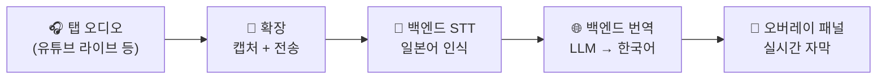

# live-translator

브라우저 탭 오디오(예: 일본어 유튜브 라이브)를 캡처해서 실시간으로 일본어를 인식하고
한국어로 번역해 화면에 띄워주는 개인용 Chrome 확장 프로그램입니다. 모든 처리는 로컬
GPU에서 실행되며 클라우드 API를 쓰지 않습니다. 시청 중인 방송에 한국어 채팅으로
답장하고 싶을 때를 위한 한국어 → 일본어 번역 기능도 있습니다.

전체 배경/설계 근거는 `docs/planning/PRD.md`, 아키텍처는 `CLAUDE.md` 참고.

## 파이프라인



탭 오디오를 확장이 캡처해 로컬 백엔드로 스트리밍하면, 백엔드가 음성 구간을 잘라
일본어로 전사하고 한국어로 번역해서 그 결과를 다시 확장으로 돌려보냅니다. 화면에는
유튜브 페이지 위에 뜨는 오버레이 패널이 이 자막을 실시간으로 보여줍니다.

## 사양

|          | 최소                              | 권장 (실제 개발 환경)              |
| -------- | --------------------------------- | ----------------------------------- |
| GPU      | NVIDIA, CUDA 지원, VRAM 8GB+      | **RTX 4080 SUPER (16GB)** — 지금 채택된 모델 조합이 여기서 튜닝/검증됨 |
| Chrome   | 109+ (`chrome.offscreen` API 필요) | 최신 안정 버전                      |
| Python   | 3.10+                              | 3.10+                                |

GPU VRAM이 16GB보다 많이 낮으면 지연이 늘어날 수 있습니다 — 그럴 땐 STT 모델을
`large-v3-turbo`에서 `medium`으로 낮추는 것도 옵션입니다 (`backend/config.py`).

## 설치

- **llama.cpp server** (CUDA 빌드) — 번역용. 채택 모델은 **gemma-3-12b-it Q4_K_M**
  (GGUF, 선정 근거: `docs/eval/EVAL_REPORT_gemma-3-12b-it_2026-08-18.md`). 둘 다
  `.gitignore`로 저장소에는 포함되어 있지 않음.

저장소 루트(`live-translator/`)에서:

```bash
# 1. Python 의존성 설치
pip install -r backend/requirements.txt

# 2. torch + torchaudio는 별도 설치 (backend/vad.py의 silero-vad용, CUDA 버전에 맞게)
pip install torch torchaudio --index-url https://download.pytorch.org/whl/cu121
```

첫 VAD 로드 시 `torch.hub`가 silero-vad 모델을 한 번 다운로드합니다 (이후
`~/.cache/torch/hub`에 캐시되어 오프라인 동작).

번역 엔진(`llama-server`)과 모델은 다음 경로에 배치:

```
llama-server/llama-server.exe                      # llama.cpp 릴리스(CUDA 빌드)에서 다운로드
backend/models/google_gemma-3-12b-it-Q4_K_M.gguf   # 사용할 GGUF 모델
```

## 사용법

가장 간단한 방법: 저장소 루트의 `start.cmd`를 더블클릭하면 번역 서버(llama-server) +
백엔드가 콘솔 창 없이 트레이 아이콘 하나로 뜹니다(우클릭 메뉴로 로그 확인/종료). 아래는
수동으로 하나씩 띄우는 방법(디버깅 등에 필요할 때).

세 개를 순서대로 띄웁니다.

**1) 번역 서버 (llama-server)**

```bash
llama-server/llama-server.exe -m backend/models/google_gemma-3-12b-it-Q4_K_M.gguf --port 8080 -ngl 999 -c 4096
```

**2) 백엔드 (FastAPI, 반드시 저장소 루트에서 실행 — `backend.*` 절대 import 때문)**

```bash
uvicorn backend.main:app --reload --port 8000
```

시작 시 glossary → VAD(silero) → STT 모델(faster-whisper)을 로드한 뒤, 번역 서버에
연결해 GBNF grammar 지원 여부를 확인합니다. 번역 서버는 백엔드보다 늦게 켜도
됩니다(경고만 남고 기동은 계속).

**3) Chrome 확장**

1. `chrome://extensions` → 우측 상단 "개발자 모드" 켜기
2. "압축해제된 확장 프로그램을 로드합니다" → `extension/` 폴더 선택
3. 일본어 유튜브 라이브 등을 열고 툴바의 확장 아이콘 클릭
   → 캡처가 바로 시작되고, 영상 위에 오버레이 패널이 뜹니다.
4. 오버레이 패널:
   - 헤더의 ● 버튼으로 일시정지/재개, ✕로 완전 종료, ─로 최소화
   - 드래그로 이동, 가장자리/모서리로 크기 조절
   - 실시간 전사 로그: partial(흐린 글씨)과 final(선명한 글씨)이 구분되어 표시
   - 헤더 아래 볼륨 막대로 오디오가 실제로 들어오고 있는지 확인 가능
   - 방송 맥락 1줄 요약이 로그 위에 주기적으로 갱신됨
   - 하단 채팅 답장란: 한국어를 입력하면 방송 맥락에 맞는 일본어로 번역 —
     `'단어'`는 히라가나로, `"단어"`는 카타카나로 강제 표기 가능
5. 여러 탭을 동시에 캡처할 수 있습니다 — 탭마다 독립적인 오버레이 패널이 뜹니다.

확장 코드를 수정한 뒤에는 `chrome://extensions`에서 해당 확장을 새로고침해야 합니다.

## 설정

`backend/config.py`에서 STT 모델 크기, VAD 침묵 임계값, 번역 서버 URL/타임아웃,
맥락 요약 갱신 주기 등 튜닝 가능한 상수들을 관리합니다 (환경변수/dotenv 레이어는
아직 없음 — 개인 로컬 머신 전용이라 불필요).

고유명사 번역은 `backend/glossary.json`에 `{"일본어 표기": "한국어 표기"}`로 등록합니다.
매칭은 NFKC 정규화 후 이뤄지므로 전각/반각 표기 차이는 무시됩니다.

## 테스트 / 린트

정식 테스트/린트 러너는 아직 없습니다. 유일한 자가 체크는
`python -m backend.glossary` (glossary NFKC 매칭 검증, GPU 불필요).
