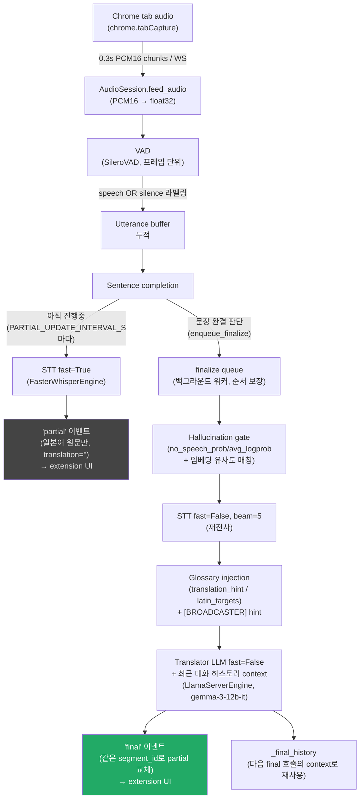
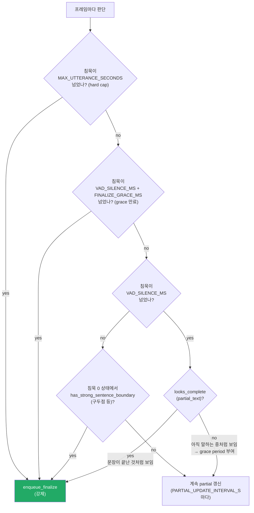
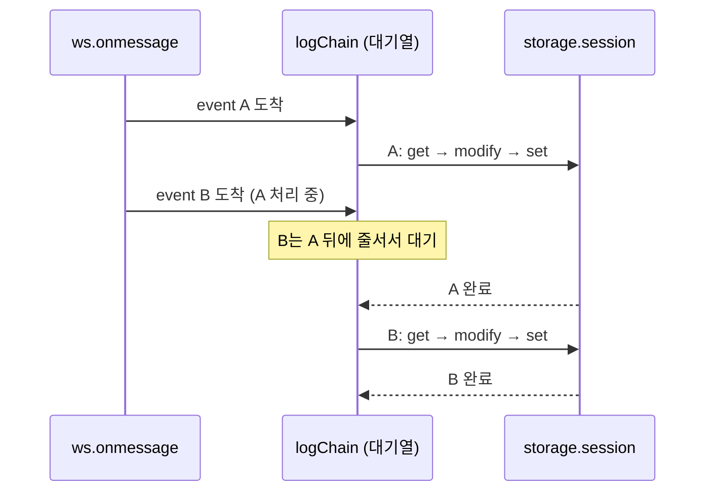

# Pipeline overview

Data flow from captured tab audio to displayed translation. See `backend/audio_session.py`
(`AudioSession`) for the implementation and `CLAUDE.md` §"Streaming / sentence-finalization
strategy" for the product rationale behind the partial/final split.

- 회색(P4) = partial 표시, 초록(F4) = final 표시.
- **partial 트랙은 STT만 한다 — 번역이 없다.** 2026-08-19에 라이브 partial 번역(문맥 없는
  fast LLM 호출)이 run-on 세그멘테이션 문제와 겹쳐 확신에 찬 오역을 만드는 게 확인되어
  의도적으로 비활성화됐다 (`_emit_partial`의 번역 호출부는 주석 처리, 코드는 남아 있음 —
  `CLAUDE.md` "Streaming / sentence-finalization strategy" 참고). `"partial"` WS 이벤트는
  항상 `translation: ""`로 나간다.
- partial 트랙은 메인 오디오 처리 루프(`_process_frame`) 안에서 `await`로 실행된다 —
  이벤트 루프는 막지 않지만 **오디오 드레인(`feed_audio`)은 partial STT가 끝날 때까지
  대기**한다. 백그라운드 분리는 `docs/planning/IMPROVEMENT_SPECS.md` Q2로 계획됨.
- final 트랙은 별도 `asyncio.Queue` + 백그라운드 워커 태스크(`_finalize_worker`)로 분리되어,
  느린 beam=5 STT + LLM 호출이 오디오 수신 경로를 막지 않는다. 발화 순서는 큐 순서로 보장된다.
- **VAD_SILENCE_MS/FINALIZE_GRACE_MS는 고정값이 아니라 세션 적응형이다** (S5,
  `AudioSession._effective_silence_ms`/`_effective_grace_ms`) — 세션 안에서 관찰된 실제
  발화 간 침묵 간격과 말속도의 EMA로 매 finalize 판정마다 값을 조정한다(상하한 clamp 있음).
  아래 "Sentence completion 상세" 절의 `VAD_SILENCE_MS`/`FINALIZE_GRACE_MS` 표기는 이
  적응형 유효값(effective value)을 가리키는 것으로 읽을 것.
- 예외 경로(다이어그램에는 없음): STT/번역/이벤트 전송이 실패해도 세션과 워커는 죽지 않는다
  — 해당 utterance의 마지막 partial 전사/번역으로 폴백한 final을 방출하고 계속 진행한다
  (`docs/planning/IMPROVEMENT_SPECS.md` R1).
- **노래/BGM 감지는 현재 비활성 상태다** (`vanilla` 브랜치, 2026-08-26) — `backend/music_gate.py`와
  그 호출부(`audio_session.py`/`main.py`/`config.py`)는 삭제가 아니라 전부 주석 처리돼 있다.
  `"final"` 이벤트의 `music_suspected` 필드는 항상 고정 `false`로 나간다. 재개 시 참고할 것과
  중단 경위는 `docs/planning/IMPROVEMENT_BACKLOG.md`의 M1 섹션 참고.
- 캡처 오디오는 offscreen.js가 **16kHz `AudioContext`**로 받는다 — 크롬이 내장
  안티앨리어싱 리샘플러로 변환해주므로 확장 쪽 수동 리샘플 없이 PCM16 변환만 해서 보낸다.
- WebSocket 수명주기: 캡처 중 연결이 끊기면 offscreen.js가 백오프(1s→최대 10s)로 자동
  재연결한다 — 새 연결마다 백엔드는 새 `AudioSession`을 만든다. Stop Capture 시에는
  `stop_session`만 보내고 소켓을 열어둔 채, 백엔드가 finalize 큐를 드레인(`close()`, 최대
  `CLOSE_DRAIN_TIMEOUT_S`)하고 소켓을 닫아주기를 기다린다(12s 강제종료 안전장치) —
  마지막 문장들의 final이 이 드레인으로 도착한다.

## Sentence completion 상세

매 프레임 `_process_frame`에서 판단하는 finalize 게이트. `backend/audio_session.py`,
`backend/sentence_completion.py` 참고.

- **1차 신호(침묵)**: `VAD_SILENCE_MS`가 finalize 여부를 판단하는 기본 트리거.
- **2차 보정(문맥)**: 침묵을 넘었어도 `looks_complete`가 "말이 안 끝난 것 같다"고 하면
  `FINALIZE_GRACE_MS`만큼 봐주고 기다린다 — 화자가 문장 중간에 잠깐 멈춘 경우를 보호.
- **안전장치**: grace 유예가 끝나거나(`FINALIZE_GRACE_MS` 만료) 발화가 너무 길어지면
  (`MAX_UTTERANCE_SECONDS`, hard cap) 모양과 상관없이 강제로 finalize.
- **선제적 분할**: 침묵이 전혀 없어도(`silence_ms == 0.0`) `has_strong_sentence_boundary`가
  강한 문장 종결 신호(마침표 등)를 감지하면 즉시 finalize — 쉬지 않고 말하는 화자를 문장
  단위로 쪼갠다.

## extension/background.js: transcript log 큐 처리

`chrome.storage.session`은 read-modify-write라 동시 호출이 겹치면 나중에 커밋된 쪽이 먼저
커밋된 쪽의 갱신을 통째로 덮어쓴다 (예: A의 `final` 갱신이 뒤이은 B의 저장에 의해 다시
`partial`로 되돌아감). `queueAppendToLog`는 프라미스 체인으로 호출을 한 번에 하나씩,
도착 순서대로 강제 직렬화해서 이 race를 막는다.

- **한 줄 요약**: 이벤트가 아무리 몰려와도 `logChain`이라는 한 줄 대기열에 순서대로 서고,
  앞 이벤트의 저장이 끝나야 다음 이벤트가 저장을 시작한다 — 동시에 두 개가 storage를
  건드리는 일 자체가 없다.
- 라이브 팝업 화면(`popup.js`)은 이 대기열과 무관하게 WS 메시지를 직접 받아 그리므로
  영향받지 않는다. 이 대기열은 오직 `chrome.storage.session`에 저장되는 히스토리(팝업
  재오픈 시 `restoreHistory()`가 읽는 값)의 일관성만 지킨다.
- **역할 요약**:
  - `ws.onmessage` — 이벤트가 시작되는 발생지. 백엔드가 보낸 `partial`/`final`을 받아
    `TRANSCRIPT_EVENT`로 브로드캐스트한다.
  - `logChain` — 저장 작업들의 교통정리. 이벤트가 몰려와도 `appendToLog` 실행을 도착
    순서대로 한 번에 하나씩 직렬화하는 프라미스 체인.
  - `storage.session` — 실제 데이터가 담기는 곳. 직렬화가 지켜야 하는 공유 저장소이자,
    팝업 재오픈 시 `restoreHistory()`가 읽어오는 대상.
- **`appendToLog`의 get → modify → set** (`background.js:80-89`): `storage.session`엔
  "배열 항목 하나만 갱신"하는 API가 없어서, 매번 전체를 흉내내는 3단계로 반영한다.
  - **get** — `transcriptLog` 배열 전체를 읽어옴.
  - **modify** — 이벤트와 `segment_id`가 같은 항목을 찾아 교체(없으면 push), 그다음
    `slice(-MAX_LOG_ENTRIES)`로 최근 200개만 남김.
  - **set** — 만들어진 새 배열 전체를 다시 통째로 저장.
  - 이 사이클이 곧 race의 근원이다 — get 시점 스냅샷을 들고 있다가 set으로 통째로
    덮어쓰므로, 두 호출이 겹치면 나중에 set하는 쪽이 그 사이 다른 쪽이 커밋한 갱신을
    지워버린다. `logChain`은 이 한 사이클이 끝나야 다음 사이클이 시작되도록 강제해서
    겹침 자체를 막는다.
- `transcriptLog`는 세션 **시작** 시점에 비워진다(stop이 아님) — stop 직후 백엔드 드레인으로
  늦게 도착하는 final들이 로그에 남고, 다음 캡처를 시작할 때까지 히스토리를 다시 볼 수 있다.
