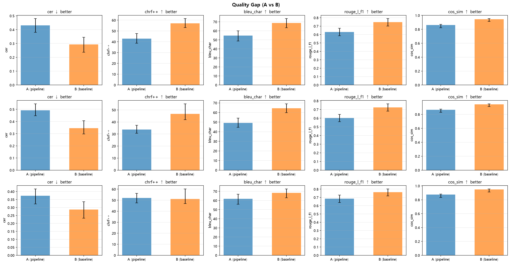
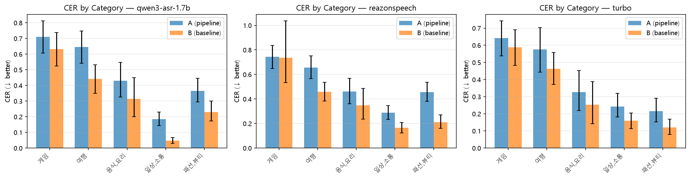
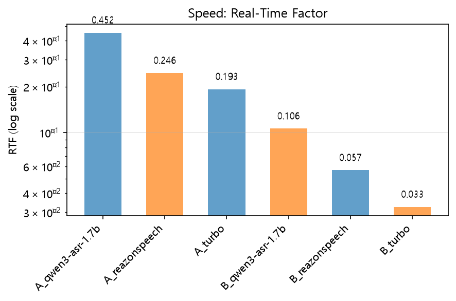

# 01. 정량 결과 — VAD-STT 파이프라인(A) vs 통청취 STT(B) 갭

## 1. 배경과 한계 (DESIGN.md §10 요약)

20260826 STT 서베이는 클립 전구간을 한 번에 청취해 전사(B)했다. 실제 앱은 그 사이에
0.3초 청크화 → SileroVAD → 침묵 기반 종단판정(+선제 분할, hard cap) → partial 재전사
트랙 + finalize 큐 → RMS 게이트 → HallucinationGate → beam=5 최종 재전사 스택이 낀다.
이 실험은 그 스택을 실제로 통과시킨 전사(A)를 통청취 전사(B)·라벨(C)과 대조해 갭을
측정한다. 3개 엔진(turbo, qwen3-asr-1.7b, reazonspeech) × 150클립 = A 450건.

**한계 (보고서 전체에 적용)**:
1. 평가셋이 이미 문장 단위 짧은 클립이라 run-on/선제분할/hard cap 경로를 거의 안
   건드린다. 측정된 갭은 "VAD 트림 + RMS/환각 게이트 + partial/final beam 차 +
   세그먼테이션"의 합이지 "문장 중간 오절단"이 아니다.
2. 가상 클럭은 프로덕션이 GPU 부하로 실시간을 못 따라가는 상황을 재현 못 한다 — S1이
   PASS(아래)면 현재 조건에선 동등 가정 가능.
3. A−B 디코딩 파라미터 교란요인: B는 통청취 1회 전사, A의 final은 beam=5. 완전
   동일하진 않을 수 있어 갭의 일부로 간주.
4. turbo는 no_speech_prob/avg_logprob 환각 필터가 활성, qwen3-asr/reazonspeech는
   inert(비대칭 3-way).
5. Claude 단독 정성 채점(report/02).

## 2. 가상 클럭 검증 (S1)

10클립을 가상 클럭 vs 실시간 `asyncio.sleep`으로 각각 돌려 전사결과 A를 비교.

| 지표 | 값 |
|---|---|
| max CER | 0.0000 |
| mean CER | 0.0000 |
| 판정 | **PASS** (기준 ≤0.01) |

10클립 전부 가상/실시간 결과가 문자 그대로 동일 — 이후 결과는 가상 클럭 기준으로
신뢰 가능.

## 3. 정량 갭 — A vs B, 엔진별 (paired bootstrap 2000회, 95% CI, Holm 보정, n=150)

| 엔진 | 지표 | A [95% CI] | B [95% CI] | A−B [95% CI] | p(raw) | p(Holm) | 판정 |
|---|---|---|---|---|---|---|---|
| qwen3-asr-1.7b | CER↓ | 0.431 [0.380, 0.487] | 0.293 [0.244, 0.345] | +0.138 [0.112, 0.165] | <0.0001 | <0.0001 | gap |
| qwen3-asr-1.7b | chrF++↑ | 42.92 [38.59, 46.86] | 57.04 [52.36, 61.44] | −14.13 [−16.65, −11.64] | <0.0001 | <0.0001 | gap |
| qwen3-asr-1.7b | BLEU-char↑ | 54.71 [48.80, 59.93] | 68.73 [63.36, 73.55] | −14.02 [−17.01, −11.18] | <0.0001 | <0.0001 | gap |
| qwen3-asr-1.7b | ROUGE-L F1↑ | 0.631 [0.585, 0.677] | 0.747 [0.703, 0.790] | −0.116 [−0.143, −0.090] | <0.0001 | <0.0001 | gap |
| qwen3-asr-1.7b | cos_sim↑ | 0.861 [0.823, 0.894] | 0.945 [0.936, 0.954] | −0.084 [−0.117, −0.055] | <0.0001 | <0.0001 | gap |
| turbo | CER↓ | 0.373 [0.322, 0.427] | 0.287 [0.244, 0.336] | +0.086 [0.056, 0.119] | <0.0001 | <0.0001 | gap |
| turbo | chrF++↑ | 52.08 [47.56, 56.27] | 51.14 [47.07, 60.24] | +0.93 [−7.35, 3.34] | 0.6860 | 0.6860 | **reached** |
| turbo | BLEU-char↑ | 61.82 [55.80, 67.08] | 68.27 [63.20, 72.68] | −6.45 [−9.57, −3.64] | <0.0001 | <0.0001 | gap |
| turbo | ROUGE-L F1↑ | 0.686 [0.638, 0.731] | 0.764 [0.723, 0.803] | −0.078 [−0.106, −0.051] | <0.0001 | <0.0001 | gap |
| turbo | cos_sim↑ | 0.874 [0.833, 0.911] | 0.948 [0.939, 0.957] | −0.074 [−0.112, −0.041] | <0.0001 | <0.0001 | gap |
| reazonspeech | CER↓ | 0.492 [0.447, 0.539] | 0.345 [0.291, 0.407] | +0.147 [0.095, 0.190] | <0.0001 | <0.0001 | gap |
| reazonspeech | chrF++↑ | 33.69 [30.60, 38.55] | 46.76 [43.13, 55.12] | −13.08 [−21.00, −8.98] | <0.0001 | <0.0001 | gap |
| reazonspeech | BLEU-char↑ | 49.24 [44.53, 53.84] | 64.47 [59.60, 69.11] | −15.23 [−19.09, −11.28] | <0.0001 | <0.0001 | gap |
| reazonspeech | ROUGE-L F1↑ | 0.602 [0.559, 0.644] | 0.724 [0.682, 0.766] | −0.122 [−0.149, −0.096] | <0.0001 | <0.0001 | gap |
| reazonspeech | cos_sim↑ | 0.866 [0.829, 0.897] | 0.944 [0.934, 0.952] | −0.078 [−0.110, −0.050] | <0.0001 | <0.0001 | gap |

**요약**: qwen3-asr-1.7b(현 프로덕션)와 reazonspeech는 5개 지표 전부 `gap`(A가 B보다
통계적으로 유의미하게 나쁨). turbo는 4개 지표가 `gap`이고 chrF++만 `reached`(CI가
0을 포함, Holm p=0.686). **1차 목표("VAD-STT가 통청취 STT 품질에 통계적으로 도달")는
3개 엔진 모두 달성되지 않았다.**

*그림 1. 엔진별 5개 지표에서 A(파이프라인, 실선 없는 막대)와 B(통청취) 비교, 95% CI
오차막대. 모든 엔진에서 A가 B보다 체계적으로 낮게(또는 CER은 높게) 나타난다.*

## 4. 카테고리별 CER

*그림 2. 5개 카테고리 × 3엔진 × {A,B}의 CER. 갭은 모든 카테고리에서 관찰되며 특정
카테고리에 국한되지 않는다 — `20260826_.../report/03`에서 ReazonSpeech의 정량 갭이
게임 카테고리(BGM 반복 루프)에 집중됐던 것과 달리, 이번 A-B 갭은 카테고리 전반에
고르게 분포한다(세그먼테이션/게이트 구조 자체의 효과이기 때문으로 해석).*

## 5. RTF (속도)

| 엔진 | RTF(A) | RTF(B) | 비율 A/B [95% CI] |
|---|---|---|---|
| qwen3-asr-1.7b | 0.452 | 0.106 | 4.26x [3.31, 5.25] |
| reazonspeech | 0.246 | 0.057 | 4.33x [3.79, 4.83] |
| turbo | 0.193 | 0.033 | 5.91x [4.93, 6.94] |

*그림 3. A(파이프라인, partial+final STT 합산)가 B(통청취 1회)보다 4~6배 높다 —
partial 재전사가 클립당 여러 번 도는 구조상 당연한 결과다. 절대값은 3개 엔진 모두
1.0을 크게 밑돌아 실시간 처리에는 여유가 있다.*

## 6. 파이프라인 내부 원인 분석

`pipeline_transcripts.jsonl` 집계(150클립):

| 엔진 | 평균 n_finals | n_finals=0 클립 | 평균 n_dropped_finals | 평균 n_partial_calls | finalize_reason_counts |
|---|---|---|---|---|---|
| qwen3-asr-1.7b | 3.65 | 9 | 0.08 | 3.26 | silence_complete=57, strong_boundary=**386** |
| turbo | 1.47 | 11 | 0.15 | 3.91 | hard_cap=2, silence_complete=55, strong_boundary=65 |
| reazonspeech | 2.96 | 8 | 0.09 | 2.79 | silence_complete=58, strong_boundary=**282** |

**해석**:
- **`strong_boundary`(선제 분할, `has_strong_sentence_boundary`)가 qwen3-asr/
  reazonspeech에서 turbo 대비 4~6배 더 많이 발동한다.** 이 두 엔진은 partial STT
  단계에서 짧은 발화 단위마다 문말 구두점(。！？)을 붙이는 경향이 있어(§ report/02
  정성 채점의 문장부호 축과 무관하게, partial 텍스트 자체에 자주 붙음), 버퍼가
  실제 문장이 끝나기 전에 조기 종단판정되어 클립당 finals 수가 급증한다(qwen 평균
  3.65 vs turbo 1.47). report/02에서 A_qwen3-asr-1.7b/A_reazonspeech 전사가 짧은
  조각들이 공백으로 이어붙은 형태로 자주 관찰되는 것과 일치한다.
- 과분절은 각 조각이 문맥 없이 독립적으로 재전사되게 만들어(final은 그 시점까지의
  버퍼만 봄) 대명사 생략/문맥 의존 표현이 깨지기 쉽고, 이것이 CER/chrF++/의미
  임베딩 유사도 저하의 상당 부분을 설명하는 것으로 보인다.
- `n_dropped_finals`(RMS+환각 게이트로 버려진 final)는 전 엔진 0.08~0.15/클립으로
  작다 — 게이트 자체의 과도한 드롭은 갭의 주 원인이 아니다.
- `n_finals=0`(전체 무음/게이트 드롭) 클립이 8~11개(150 중) 존재 — 빈 A가 CER=1.0을
  강제해 코퍼스 평균을 끌어올린다. B는 통청취라 이런 완전 드롭이 구조적으로 적다.

## 7. 결론

1차 목표(VAD-STT 파이프라인 품질이 통청취 품질에 통계적으로 도달)는 **3개 엔진 모두
미달성**이다. turbo만 chrF++ 1개 지표에서 갭이 없었고 나머지는 전부 유의미한 갭이
있다. 원인은 게이트의 과도한 드롭보다는 **`strong_boundary`(선제 분할) 과다 발동으로
인한 과분절**로 보이며, 특히 qwen3-asr-1.7b(현 프로덕션)에서 가장 심하다(strong_boundary
386회, turbo의 5.9배).

**후속 ablation 우선순위 제안** (DESIGN §1.3/§9):
1. `has_strong_sentence_boundary`(선제 분할) 튜닝 — qwen3-asr/reazonspeech처럼 partial
   텍스트에 구두점이 잦은 엔진에서 오탐이 나는지 확인. 엔진별 다른 임계치/휴리스틱
   필요 여부 검토.
2. `PARTIAL_UPDATE_INTERVAL_S`/`MIN_PARTIAL_AUDIO_SECONDS` — partial 케이던스가
   선제 분할 오탐 빈도에 미치는 영향.
3. A−B 디코딩 파라미터 정합(§한계3) — final의 beam=5가 B의 서베이 스크립트 설정과
   정확히 일치하는지 확인 후 필요시 B 재실행.
